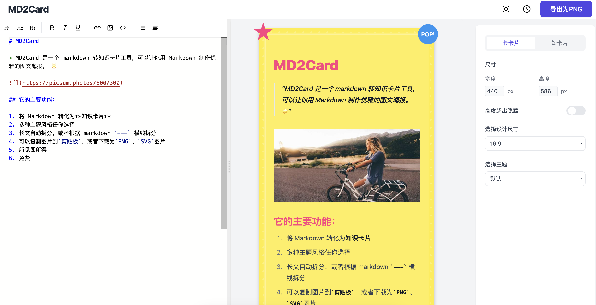

# MD2Card

MD2Card 是一个简洁高效的 Markdown 转换工具，可以将 Markdown 文本转换为精美的卡片图片。

## ✨ 功能特性

- 🚀 实时预览：编辑 Markdown 时即时查看渲染效果
- 🎨 主题切换：内置多种精美主题样式
- 📱 响应式设计：完美适配各种屏幕尺寸
- 💾 自动保存：编辑内容自动保存，无需担心丢失
- 📤 导出图片：一键将卡片导出为图片格式

## 🛠️ 技术栈

- React + TypeScript
- Vite
- Tailwind CSS
- Monaco Editor
- Marked
- Zustand
- Styled Components

## TODO

- [ ] 增加更多主题样式
- [ ] 支持导入导出 Markdown 文件
- [ ] 增加更多导出格式


## 📦 安装

```bash
# 使用 pnpm 安装依赖
pnpm install

# 启动开发服务器
pnpm dev

# 构建生产版本
pnpm build
```

## 🚀 使用方法

1. 在左侧编辑器中输入 Markdown 文本
2. 右侧实时预览渲染效果
3. 使用顶部工具栏调整主题和样式
4. 点击导出按钮保存为图片

## 📸 预览



## 🎨 示例

```markdown
# 标题
## 子标题

这是一段示例文本，你可以在这里编写 Markdown 内容。

### 列表示例
- 项目 1
- 项目 2
- 项目 3

### 代码示例
```javascript
console.log('Hello World');
```

> 这是一段引用文本

**粗体文本** *斜体文本*
```

## 📄 开源协议

[MIT License](LICENSE)

